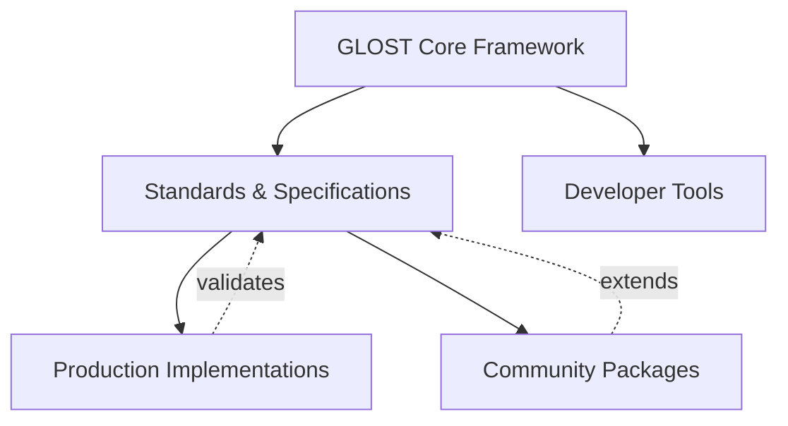

# GLOST Ecosystem

## Overview

GLOST is designed as a **core framework** that aims to enable an ecosystem of implementations, tools, and integrations. This document describes our ecosystem vision and how you can participate.

## Ecosystem Model



### Layers

#### 1. Core Framework

**Repository:** This repo  
**Scope:** Foundation types, node creation, extension system

**Packages:**
- `glost` - Core types and node factories
- `glost-common` - Language utilities and shared code
- `glost-extensions` - Extension system and built-in extensions
- `glost-utils` - Text parsing and manipulation

**Responsibility:**
- Define GLOST node types
- Provide extension architecture
- Maintain TypeScript types
- Keep it lightweight and focused

#### 2. Standards & Specifications

**Scope:** Recommended patterns and schemas that benefit all implementers

**Standards:**
- [Metadata Schema](./standards/metadata-schema.md) - Standard metadata structure
- [Transcription Providers](./guides/implementing-transcription-providers.md) - Three proven approaches
- [Naming Conventions](./conventions/naming.md) - Package naming patterns
- [Plugin Interface](./standards/plugin-interface.md) *(planned)* - Framework integration standards

**Why Standards Can Help:**
- Could enable interoperability between implementations
- Facilitate shared learning and best practices
- May make it easier for new implementers
- Help align community efforts

#### 3. Production Implementations

**Scope:** Applications built on GLOST

**Examples:**
- Multi-language learning platforms
- Interactive reading applications
- Transcription and pronunciation tools
- Vocabulary builders and flashcard systems
- Graded reader platforms

**Characteristics:**
- Built on GLOST core
- Tested with real users
- Opinionated implementations
- Can include frameworks (React, Vue)

#### 4. Community Packages

**Scope:** Focused packages that extend GLOST

**Categories:**
- **Language Packages:** `glost-{lang}` - Language-specific helpers and transcription interfaces
- **Data Sources:** `glost-{lang}-datasource-{source}` - Dictionary and corpus data
- **Transcription Systems:** `glost-{lang}-transcription-{system}` - Specific transcription implementations
- **Lookup Factories:** `glost-{lang}-lookup-{type}-{system}-{source}` - Combined lookup solutions
- **Plugins:** `glost-plugin-{framework}` - Framework integrations

**Examples:**
- `glost-th` - Thai language support (helpers, transcription interfaces)
- `glost-ja` - Japanese language support (helpers, transcription interfaces)
- `glost-th-datasource-lexitron` - Thai dictionary data
- `glost-ja-transcription-hepburn` - Japanese Hepburn romanization
- `glost-plugin-react` - React components (basic)

#### 5. Developer Tools

**Scope:** Tools for GLOST developers

**Examples:**
- Testing utilities
- Validation tools
- Documentation generators
- Migration scripts
- IDE extensions *(future)*

## How GLOST Core and Implementations Relate

### Clear Boundaries

| Aspect | GLOST Core | Production Implementations |
|--------|------------|---------------------------|
| **Scope** | Foundation types | Complete applications |
| **Dependencies** | Minimal | As needed |
| **Opinions** | Few | Many |
| **Features** | Essential | Comprehensive |
| **Maintenance** | Core team | Implementation teams |
| **React Components** | Basic (optional) | Production-ready |
| **Language Data** | Examples | Full datasets |
| **Transcription** | Interface patterns | Multiple systems |

### Complementary Strengths

**GLOST Core aims to provide:**
- A type system
- Extension architecture
- Standard patterns
- Documentation
- Reasonable stability

**Implementations can provide:**
- Real-world validation
- Practical patterns
- Additional features
- User feedback
- Innovation

### Example: React Components

**GLOST Core** (`glost-plugin-react`):
```typescript
// Basic rendering
<GLOSTWord node={word} />
<GLOSTSentence node={sentence} />
```

**Production Implementation** (community `glost-react` libraries):
```typescript
// Advanced features
<MTSTDocumentProgressive
  document={doc}
  defaultLevel={1}
  enableLevelToggle={true}
  onWordClick={handleClick}
  languageStrategy="thai"
  performanceOptimized={true}
/>
```

**Relationship:**
- GLOST provides basics for simple use cases
- Other libraries can provide production features for more complex needs
- Both work with same GLOST documents
- Users choose based on their requirements

## Production Use

GLOST has been used in real-world applications. These implementations have helped inform the patterns and standards documented here.

**What We've Learned:**
- **Multi-language support:** GLOST has been tested with multiple languages across different writing systems
- **Transcription systems:** Various systems have been implemented (IPA, romanization, phonetic)
- **Scale:** Has been used with hundreds of words with metadata
- **Performance:** Can achieve reasonable processing speeds for interactive applications

**Applications:**
- Interactive stories with progressive disclosure
- Transcription and pronunciation tools
- Vocabulary builders and flashcard systems
- Graded readers
- Content management for language learning

**Architecture Patterns That Have Worked:**
- Content package per language
- Generic conversion utilities (WordAdapter pattern)
- Pre-generated metadata for performance
- Extensible transcription providers
- Framework-specific rendering strategies

## Contributing to the Ecosystem

### As a User

1. **Build with GLOST** - Create applications
2. **Share feedback** - Help improve standards
3. **Report issues** - Help us fix bugs
4. **Write examples** - Share your use cases

### As a Package Author

1. **Follow naming conventions** - Use standard patterns
2. **Adopt metadata schema** - Use standard fields
3. **Publish to npm** - Make it discoverable
4. **Document your work** - Help others learn
5. **Add to ecosystem** - Submit PR to add your package

### As an Implementation Team

1. **Build on GLOST core** - Use standard types
2. **Share patterns** - Contribute to docs
3. **Participate in standards** - Help define best practices
4. **Showcase your work** - Case study in our docs
5. **Give feedback** - Help shape GLOST's future

## Standards Development

### RFC Process

For proposing new standards or changes:

1. **Draft proposal** - Document your idea
2. **Open discussion** - GitHub issue or discussion
3. **Gather feedback** - From core team and community
4. **Iterate** - Refine based on feedback
5. **Adopt** - Merge into standards docs

### Current Standards

**Adopted:**
- ✅ [Metadata Schema v1](./standards/metadata-schema.md)
- ✅ [Transcription Provider Patterns](./guides/implementing-transcription-providers.md)
- ✅ [Naming Conventions](./conventions/naming.md)
- ✅ [SRP/SSOT Architecture](./ARCHITECTURE_SUMMARY.md)

**Proposed:**
- 🚧 Plugin Interface Standard
- 🚧 React Component API
- 🚧 Migration/Export Formats

**Planned:**
- 📋 Corpus Processing Tools
- 📋 Testing Framework Standards
- 📋 Performance Best Practices

## Ecosystem Packages

### Official Packages

Maintained by GLOST core team:

| Package | Description | Status |
|---------|-------------|--------|
| `glost` | Core types and nodes | ✅ Active |
| `glost-common` | Language utilities | ✅ Active |
| `glost-extensions` | Extension system | ✅ Active |
| `glost-utils` | Text utilities | ✅ Active |
| `glost-plugin-inkle` | Inkle integration | ✅ Active |
| `glost-th` | Thai language support | ✅ Active |
| `glost-ja` | Japanese language support | ✅ Active |
| `glost-plugin-react` | React components (basic) | 🚧 Planned |

### Community Packages

Maintained by community:

| Package | Maintainer | Description |
|---------|------------|-------------|
| *(Add yours!)* | | Submit a PR to add your package |

**Submit a PR to add your package!**

## Getting Help

### Documentation

- [Getting Started](./getting-started.md)
- [Core Concepts](./concepts/nodes.md)
- [Extension System](./concepts/extensions.md)
- [Implementation Guides](./guides/)

### Community

- **GitHub Issues:** Bug reports and feature requests
- **GitHub Discussions:** Questions and ideas
- **Examples:** See [examples/](../examples/) directory

### For Implementers

Need help building on GLOST?

- Review [case studies](#case-studies)
- Check [implementation guides](./guides/)
- Follow [naming conventions](./conventions/naming.md)
- Study [example code](../examples/)

Want to be featured?

- Build something awesome
- Share your work
- Contribute documentation
- Submit a case study

## Ecosystem Health

### Current Status

- **Core packages:** 4 packages available
- **Languages with examples:** Several (English, Thai, Japanese, and others)
- **Production implementations:** Being used in real applications
- **Transcription systems documented:** Multiple patterns documented
- **Standard metadata fields:** Defined and being refined
- **Community packages:** Open for contributions

### Aspirations

**Short-term:**
- Continue refining core packages
- Document more implementation patterns
- Share case studies from real use
- Establish standards process

**Medium-term:**
- Encourage community packages
- Improve documentation
- Support multiple language implementations
- Build contributor community

**Long-term:**
- Grow community packages
- Support more production implementations
- Mature standards
- Expand documentation
- Share knowledge through talks/posts

## Principles

### 1. Core Stays Focused

GLOST core provides foundation, not features.

✅ **Core responsibility:**
- Types and node creation
- Extension architecture
- Basic utilities
- Documentation

❌ **Not core responsibility:**
- UI components (beyond basics)
- Data sources
- Complete language implementations
- Application frameworks

### 2. Standards Enable Ecosystem

Shared standards help everyone.

- Metadata structure
- Naming conventions
- Interface patterns
- Best practices

### 3. Implementations Validate Standards

Real production use proves patterns work.

- Standards come from experience
- Implementations test at scale
- Feedback improves standards

### 4. Clear Attribution

Credit where credit is due.

- Acknowledge contributions
- Link to source implementations
- Share learning openly

### 5. Complementary, Not Competitive

Different layers, shared success.

- Core enables implementations
- Implementations validate core
- Everyone benefits from standards

## Future Directions

### Potential Additions

**Framework Integrations:**
- Vue plugin
- Svelte plugin
- Angular support

**Language Support:**
- Arabic (RTL support)
- Russian (Cyrillic)
- Vietnamese (complex diacritics)

**Advanced Features:**
- Speech synthesis integration
- Audio alignment tools
- Spaced repetition integration
- Progress tracking standards

**Developer Tools:**
- VSCode extension
- Test fixtures library
- Migration tools
- Linter for GLOST docs

## Join the Ecosystem

Whether you're:
- Building language learning apps
- Creating linguistic tools
- Researching corpus linguistics
- Teaching languages
- Developing educational content

GLOST might provide a useful foundation for your work.

**Get started:**
1. Read [Getting Started](./getting-started.md)
2. Try [examples](../examples/)
3. Experiment with building something
4. Share feedback with the community
5. Help improve standards

We hope to build a useful ecosystem for multilingual text representation.

## See Also

- [Why GLOST?](./why.md)
- [Architecture Summary](./ARCHITECTURE_SUMMARY.md)
- [Contributing](../CONTRIBUTING.md)
- [Examples](../examples/README.md)
